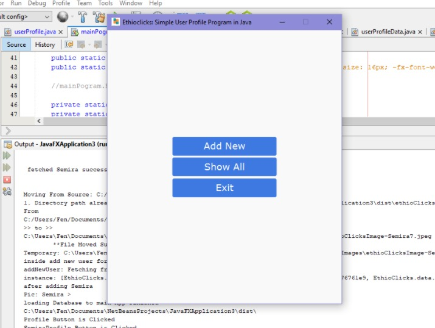
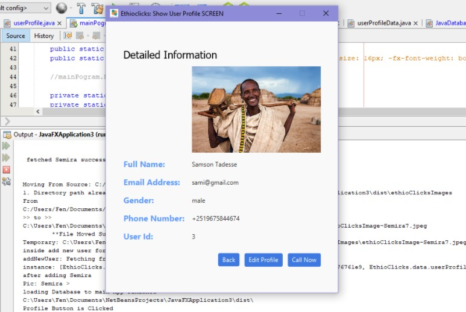
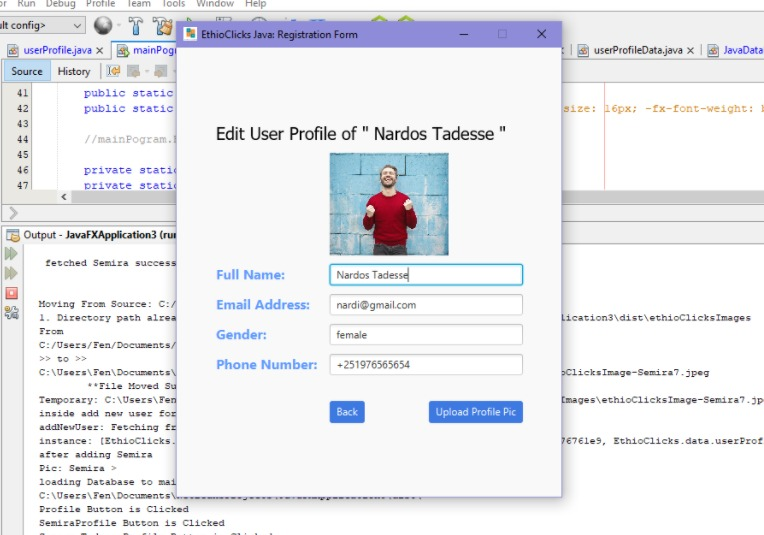
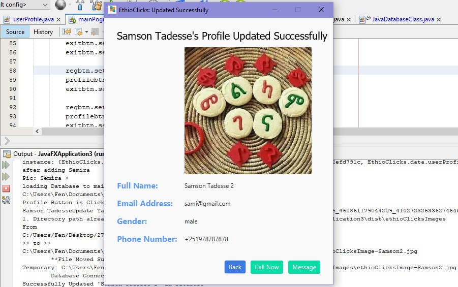

# How to Make exe installer setup program...
## 
## Table of contents
* [General Info](#general-info)
* [Technologies we Used](#technologies)
* [Making executable from Java Program](#convert-jar-program-to-executable-windows-application)
* [About Inno Setup Compiler](#about-inno-setup-compiler)
* [Creating our Setup Program](#Creating-our-setup)
* [Other Available Installers](#Installers)
* [References and Licences of 3rd party Softwares Used](#reference)

## General info
An installer can either install a new program on your computer or can update a program currently on your hard drive. It can also update or add files to your operating system. Most installers can be run by simply double-clicking the installer icon and then choosing the folder you want to install the software into. The nice thing about installers is that they do all the work for you packaging all you source files into a single setup program and at the end decompressing the program and writing the data on the hard drive. Once the installer is finished, you can often use the new or updated software right away. 

This is a documentation to show how installer program is created for a java program.for demonstraion purpose we have a simple user profile viewer GUI application which is made using java Programming language, our java program it needs many other external libraries and files as well as configuration file to work properly also it includes it's own java runtime environment and it's own independently running Mysql Server, in such scenarios installer programs are very much helpful and great tools they will bundle all these files together into a single and relatively small size setup program and makes distributing your final app to your end users very easy. before proceeding to making installer for java programs the first thing we have to do is creating windows native executable .exe from the java jar program, there are many programs available to create exe but here we will use Launch4j.exe app which is Windows native executable (.exe) java application wrapper, which Offers native splash screen, application icon, search for JRE or use bundled one, feedback on startup failure, passes command line arguments... much more. after converting jar into executable .exe the next step is to add all the neccessary files, images and dependencies and libraries together with our executable exe file  and convert them into a single setup.exe program by using setup compiler program. we used Inno setup compiler for creating our installer setup.exe program . InnoSetup is an open source compiler to create installers on windows. It is a free and provides a rich feature set. You can create professional looking installers for the end user. we will see how we are goining to create our own setup.exe from  our sample java program also these steps can be applied for any exe executables you have created by any programming language available, i will explain the basic concepts and steps involved in creating a simple setup of any exe file you want to deploy and share it to end users using installers.
## Technologies
Tools and Programs  Used 
We Used:
* Mysql Server V5.6  
     for the Database to store each users profile data
* Launch4j 
     used to Create windows native Executable .exe from our jar executable 
* Inno Setup Compiler
     to pack our application exe our icons configuration files as well as all the folders into a single setup program
* Microsoft Visual C++ Distrbution X64 
     mysql is depends on this program to work properly
	
	

## Convert jar Program to executable Windows Application

After successully building our project and exporting the project as jar file There are multiple options available for converting the jar into .exe executable windows application 
among these methods the popular one is by using the launch4j.exe application 

Launch4j is a cross-platform tool for wrapping Java applications distributed as jars in lightweight Windows native executables. The executable can be configured to search for a certain JRE version or use a bundled one(we will use our own bundler jre), and it's possible to set runtime options, like the initial/max heap size. The wrapper also provides better user experience through an application icon, a native pre-JRE splash screen, a custom process name, and a Java download page in case the appropriate JRE cannot be found.

– Launch4j's website
[Download Launch4j exe Here](http://launch4j.sourceforge.net/)
#### First Getting The Jar Files

even if the steps for Extracting  the jar file vary from one IDE to other IDE in all integrated development environments after successfully building and exporting the project our IDE will create the jar file inside our project folder including the libraries our project is configured to include.

in this sample java project we have used external database connector library since the jdbc connecor jar file will be stored inside the /lib folder of our project folder since then later when building the exe executable file we will carefully include the class path for the external libraries we have used.

* [Getting jar on Eclipse](https://www.tutorialspoint.com/eclipse/eclipse_create_jar_files.htm)
* [How to get .jar file in Netbeans](https://www.bing.com/search?q=getting+jar+netbeans&qs=n&form=QBRE&sp=-1&pq=getting+jar+&sc=8-12&sk=&cvid=A5111694CC544D6FA9837318283F016F)
* [How to get .jar file in Intellij IDEA](https://blog.karthicr.com/posts/2016/07/10/creating-an-executable-jar-in-intellij-idea/)

After Extracting Your Jar File it's better to Copy the jar and the lib folder and move into another folder location our IDE may erase our jar files let's create a new folder and let's name it a 'setup-installer-folder'
then inside create  another folder called 'bin'

![jar output directory structure]

### Creating the installer using Inno Setup involves the following two steps:
* Create Inno Script file
* Compile the Script file

## How to Create the Setup
To create this setup exe file the first thing we have to do is convert our program into executable format:

 
 
 
 
 
 

## Main Screen

 
 
 
 

## Profile Detailed Info Screen

 
 
 
 

## Edit User Profile Screen

 
 
 
 

## Succesfully Updated User  Profile

