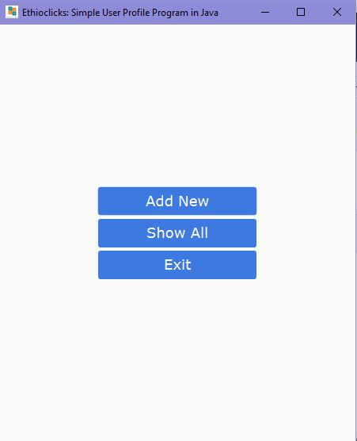
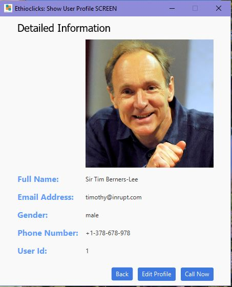
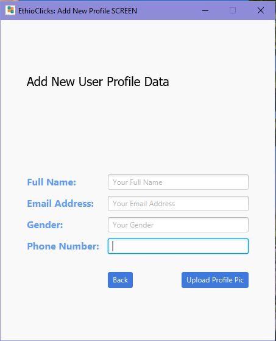
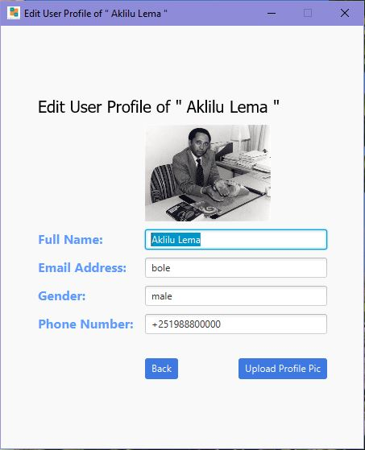
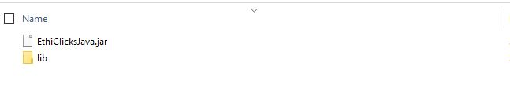
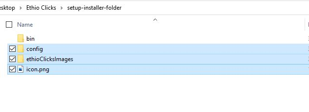
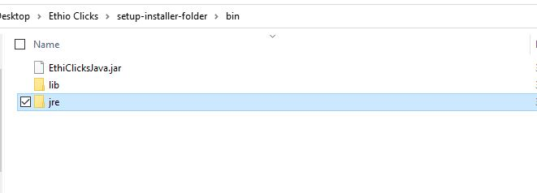
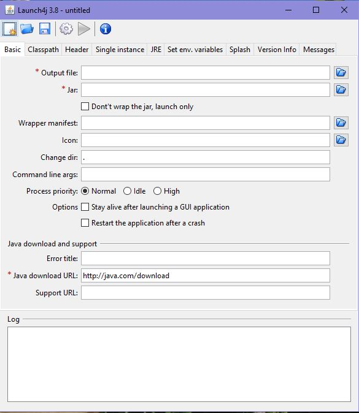
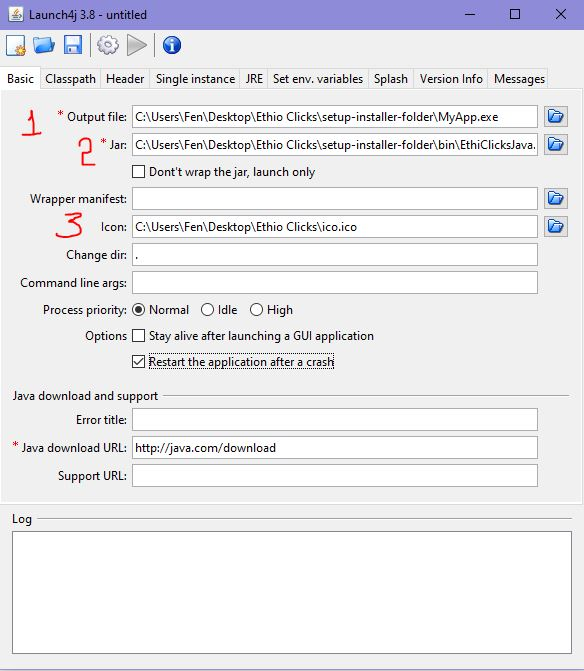

# Documentation to make exe installer Setup program
## 
## Table of contents
* [General Info](#general-info)
* [Technologies we Used](#technologies)
* [Making executable from Java Program](#convert-jar-program-to-executable-windows-application)
* [About Inno Setup Compiler](#about-inno-setup-compiler)
* [Creating our Setup Program](#Creating-our-setup)
* [Other Available Installers](#Installers)
* [References and Licences of 3rd party Softwares Used](#reference)

## General info
An installer can either install a new program on your computer or can update a program currently on your hard drive. It can also update or add files to your operating system. Most installers can be run by simply double-clicking the installer icon and then choosing the folder you want to install the software into. The nice thing about installers is that they do all the work for you packaging all you source files into a single setup program and at the end decompressing the program and writing the data on the hard drive. Once the installer is finished, you can often use the new or updated software right away. 

This is a documentation to show how installer program is created for a java program.for demonstraion purpose we have a simple user profile viewer GUI application which is made using java Programming language, our java program it needs many other external libraries and files as well as configuration file to work properly also it includes it's own java runtime environment and it's own independently running Mysql Server, in such scenarios installer programs are very much helpful and great tools they will bundle all these files together into a single and relatively small size setup program and makes distributing your final app to your end users very easy. before proceeding to making installer for java programs the first thing we have to do is creating windows native executable .exe from the java jar program, there are many programs available to create exe but here we will use Launch4j.exe app which is Windows native executable (.exe) java application wrapper, which Offers native splash screen, application icon, search for JRE or use bundled one, feedback on startup failure, passes command line arguments... much more. after converting jar into executable .exe the next step is to add all the neccessary files, images and dependencies and libraries together with our executable exe file  and convert them into a single setup.exe program by using setup compiler program. we used Inno setup compiler for creating our installer setup.exe program . InnoSetup is an open source compiler to create installers on windows. It is a free and provides a rich feature set. You can create professional looking installers for the end user. we will see how we are goining to create our own setup.exe from  our sample java program also these steps can be applied for any exe executables you have created by any programming language available, i will explain the basic concepts and steps involved in creating a simple setup of any exe file you want to deploy and share it to end users using installers.
## Technologies
Tools and Programs  Used 
We Used:
* Mysql Server V5.6  
     for our sample java project the Database to store each users profile data
* Launch4j 
     used to Create windows native Executable .exe from our sample java jar executable 
* Inno Setup Compiler
     to pack our application exe our icons configuration files as well as all the folders into a single setup program
* Microsoft Visual C++ Distrbution X64 
     mysql is depends on this program to work properly
	
	

## Convert jar Program to executable Windows Application

For demonstration we have a simple javafx program and the source code will be attached to this repository inside the project folder. you can clone this repository and open it with your java IDE or you can directly proceed into making an executable program from a jar file by select your own java project.

Our Sample Project which is created using the Apache Netbeans IDE 12.6 is a simple javafx program that will store user profile data and displays each stored user profile data into the display list , it also includes features for adding new user profile and editing already available user profile data as well. the profile data is stored into the locally available mysql server, based on java database connectivity our app directly uses the local mysql server which will be later bundled together with our application. for storing user profile data and it consists of a database connector library jar for enabling the connection between the local database and our app.

After successffully running the project our user interface Looks as follows
#### The Main Screen

 
 

#### Show All User Profile Screen

 
 

#### Detailed Profile Info Screen

 
 

#### Add New Profile Screen

 
 

#### The Edit User Profile Screen

 
 

#### The Screen to show Succesfully Updated User Profile

 
 

##### The First Step is Getting The Jar Files from Java Source Code

After successully configuring and testing the project the next step is to get the jar binary file from the finished final javafx project source code , if you know how to do it yourself it's great but if you don't know how to do it it's also awesome you are going to learn how to do it by yourself with this documentation, The steps used to export the java source code into a jar executable program varies from one IDE to other IDE's because of this we have provided a link down bellow to show you in detail and clear way to  get the jar executable file on mostly used java Integrated Development Environment's but if you are using another type of java IDE kindly search for how you can export the java source code into jar executable binary file for your specific IDE. 

* [How to get .jar file on Eclipse](https://www.tutorialspoint.com/eclipse/eclipse_create_jar_files.htm)
* [How to get .jar file in Netbeans](https://www.bing.com/search?q=getting+jar+netbeans&qs=n&form=QBRE&sp=-1&pq=getting+jar+&sc=8-12&sk=&cvid=A5111694CC544D6FA9837318283F016F)
* [How to get .jar file in Intellij IDEA](https://blog.karthicr.com/posts/2016/07/10/creating-an-executable-jar-in-intellij-idea/)

even if the steps for Extracting  the jar file vary from one IDE to other IDE in all integrated development environments after successfully building and exporting the project our IDE will create the jar file inside our project folder including the libraries our project is configured to include(external libraries will be stored inside the lib folder along our .jar file).

After Successfully making your jar file you will get an output like this

Since our sample java project includes external database connector library our IDE have created a 'lib; folder along our jar file

The Next Step is Converting the jar file into exe executable windows application, even if there are so many different options available for converting the jar into .exe executable windows application among these various methods the popular one is by using the launch4j.exe application. 

Launch4j is a cross-platform tool for wrapping Java applications distributed as jars in lightweight Windows native executables. The executable can be configured to search for a certain JRE version or use a bundled one(we will use our own bundled jre), and it's possible to set runtime options, like the initial/max heap size. The wrapper also provides better user experience through an application icon, a native pre-JRE splash screen, a custom process name, and a Java download page in case the appropriate JRE cannot be found.

– Launch4j's website
[Download Launch4j exe Here](http://launch4j.sourceforge.net/)

After successfullly finishing the above now we will have our jar file and all the neccessary libraries in our hand the next step will be to convert this jar program into an executable program , so please follow the following steps one by one.
 
Let's set our Folder Structure suitable for creating the executable as well as well organized for making the setup later on.

#### step 1. Create a new folder under your desktop or other place and name it 'setup-installer-folder'
#### step 2. Goto inside 'setup-installer-folder' and create another folder and name it 'bin'
#### step 3. Then Copy the extracted jar file and the 'lib' folder into the newly created 'bin' folder
#### step 4. Copy the 'config' and 'ethioClicksImages' folders and the 'icon.png' image from files folder of this repository into your 'setup-installer-folder' folder 

After successfully doing all the above steps you will have a folder structure like this as show on the picture below

#### Then next we will add our own java runtime environment.
we can get the Java runtime from our already installed Java Runtime software Path or if we don't have Java Runtime already installed we need to download the java JRE runtime from the oracle official website.  
Click Here to Donwload JRE [Oracle Download Java Runtime Environment](https://www.java.com/en/download/)

#### step 5. First create jre folder inside the 'setup-installer-folder/bin'  folder

#### step 6.  Goto inside the java runtime installation folder and copy the 'bin' and and 'lib' folders as shown in the picture below and paste them into the newly created jre folder inside the 'setup-installer-folder/bin/jre'. 

### Next start Lanch4j app and directly start the process of converting jar into exe

#### step 7. open  the launch4j application ( if you haven't yet downloaded the app the download link is available above ) since i'm using the Lanch4j v3.8 the first sreen you get will look like as follows if you are using the same version of launc4j launch4j v3.8 as me.

#### step 8.  Goto 'Basic' Tab and specify 3 things

* set the output File name and the directory you want it to be stored ( here the exe output should be inside setup-installer-folder as shown in the picture) (#1)
* the jar executable file we had it inside the bin folder (#2)
* and thirdly the icon you want to use for the exe program(it's optional).(#3)

#### step 9. Goto 'ClassPath' Tab and do the followings based on the numbers you see on the screen

 * first tick the 'Custom Classpath' after clicking the checkbox it will activate the view bellow the checkbox (#1)
 * then down below the checkbox on '*Main Class' column tap on the button indicated with the number 2  and select the jar file once again
 * after selecting the jar file located inside the bin folder lanch4j app will populate and fill the input boxes automatically but on our scenario we have to edit and make them suitable for our specific project so let's click on the database connecter jar file you see and click the Edit Item.
 * inside Edit item add 'bin/' before the path to database connecter library as shown in the picture above and finally tap on accept button the next sreen you will see musct look like this 
 

#### step 10.

#### step 11.

### Creating the installer using Inno Setup involves the following two steps:
* Create Inno Script file
* Compile the Script file

## How to Create the Setup
To create this setup exe file the first thing we have to do is convert our program into executable format:

 
 
 

