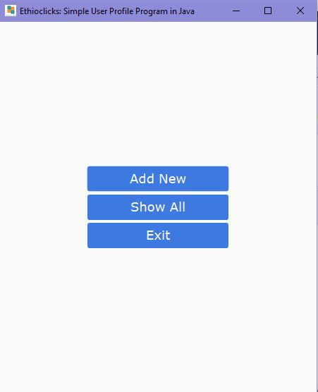
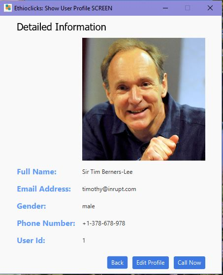
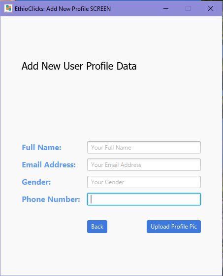
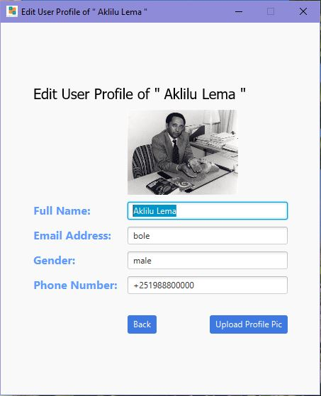

#### The Main Screen

 
 

#### Show All User Profile Screen

 
 

#### Detailed Profile Info Screen

 
 

#### Add New Profile Screen

 
 

#### The Edit User Profile Screen

 
 

#### The Screen to show Succesfully Updated User Profile

 
 

#### How To Add This Project into My Computer?

##### This Project is a javafx GUI Application Created by the Netbeans IDE v12.6 to successfully clone the source code and run the project inside your Development Environment you need to have javafx  enabled IDE. 
